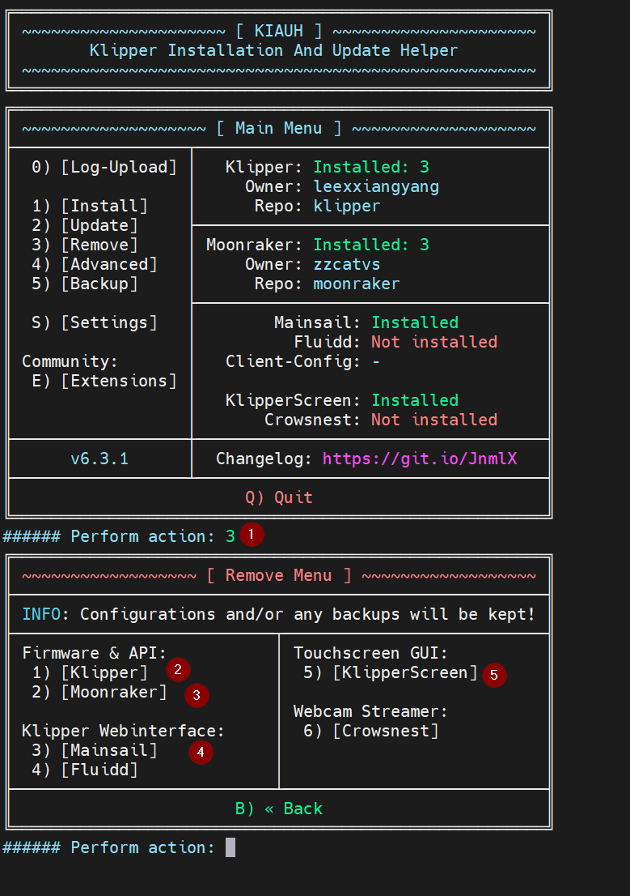
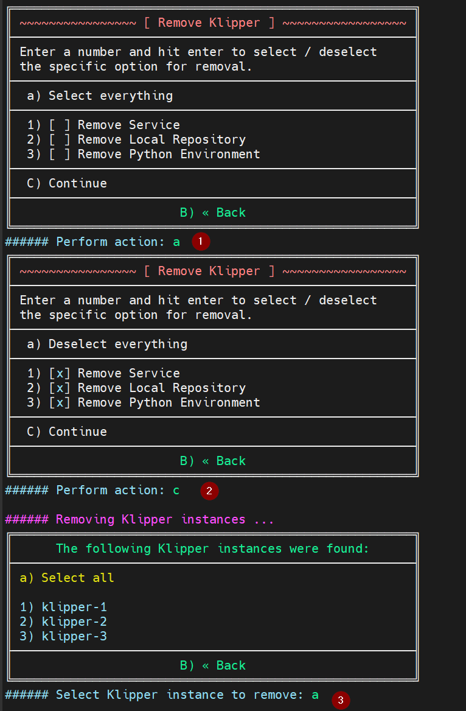
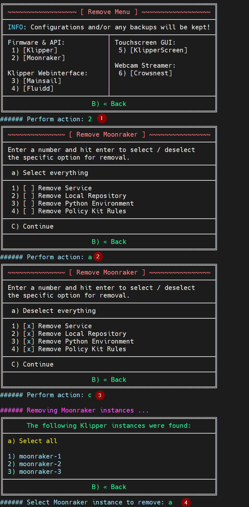
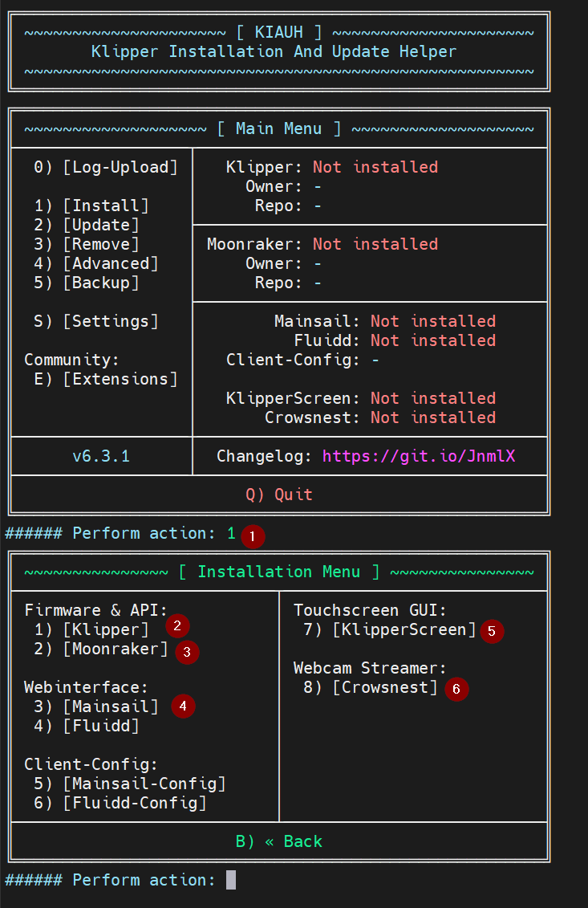
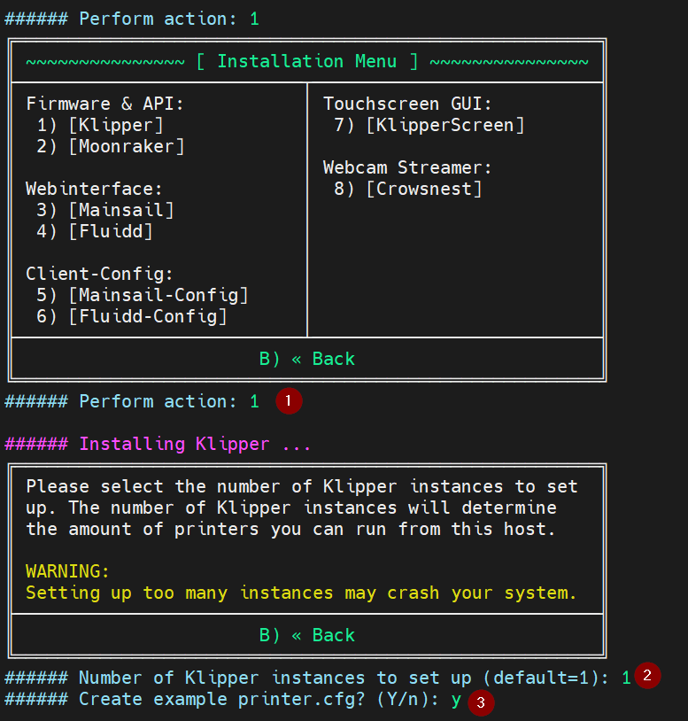
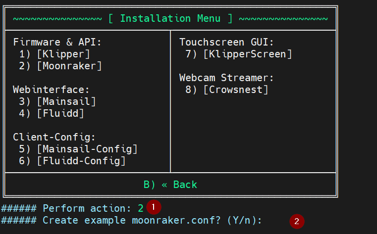

# FLSUN V400 Stock Klipper — Quick Guide

## Credits
#  Based on [Guilouz/Klipper-Flsun-Speeder-Pad](https://github.com/Guilouz/Klipper-Flsun-Speeder-Pad)


[  ](https://ko-fi.com/guilouz)

(This is the Ko‑fi of Guilouz)

<br/>


## Supported
 FLSUN V400 Speeder Pad

<br/>

## What to expect
### Automated install support in 2 pahses for:
1. Distro update (20.04 → 22.04)
1. Password update
1. Network manager with entered network & password
1. WIFI toggle (on/off every 5 minutes → To resolve connection issues)
1. Cleanup of the Flsun default builds
1. USB symlink
1. Fix moonraker shutdown
1. Restore of Flsun configs
1. Printer setting selection
1. Flsun theme restoration in Mainsail

### Optionals
1. SMB install → Windows folder share
1. Webmin → Management dashboard

### What not to expect:
1. Full replacement of the formentioned repo
1. Automated removal with KIAUH
1. Automated install with KIAUH

<br/>

## Installation instructions

1. Log in to your Speeder Pad (SSH).
- [MobaXterm (recommended)](https://mobaxterm.mobatek.net/download.html)
  
2. Make sure you have Git:

<br/>

   ```shell
   git --version
   ```
   If Git is missing → see [Install Git (if needed)](#install-git-if-needed)

<br/>
   
3. Make sure you have internet:

<br/>

   ```shell
   ping -c 1 8.8.8.8
   ```

<br/>

4. ## Clone and run phase 1:

<br/>


   ```shell
   git clone https://github.com/VLoorenDeJong/FLSUN_V400_Installing_stock_klipper && cd FLSUN_V400_Installing_stock_klipper && sudo chmod -R +x . && sudo ./install_scripts/start_install.sh
   ```
<br/>

- `cd ...` — enter project folder
- `sudo chmod -R +x .` — make scripts executable (safe to repeat)
- `sudo ./install_scripts/start_install.sh` — start menu
<br/>

5. ## After reboot:
<br/>

   ```shell
   cd FLSUN_V400_Installing_stock_klipper && sudo chmod -R +x . && sudo ./install_scripts/start_install.sh
   ```
<br/>


- `cd ...` — enter project folder
- `sudo chmod -R +x .` — make scripts executable (safe to repeat)
- `sudo ./install_scripts/start_install.sh` — start menu

<br/>
<br/>

## Phase 1 prompt suggestions
1. **Phase 1:** OS prep & upgrade (reboots)


<br/>

---
<br/>


<br/>

---
<br/>


<br/>

---
<br/>

2. **Phase 2:** FLSUN installer prep (with optionals) (reboots)

## Phase 2 prompt suggestions


<br/>

---
<br/>



<br/>

---
<br/>



<br/>

---
<br/>



<br/>

---
<br/>


<br/>

---
<br/>


<br/>

---
<br/>



<br/>

---
<br/>



<br/>

---
<br/>



<br/>

---
<br/>


## **To re-run a phase:**
1. Start the script
2. Press `o` for override
3. Select the phase

## Install Git (if needed)
<br/>

```shell
sudo apt update && sudo apt install git && git --version
```

## Note
To skip a certain step comment out the script in `install_scripts\start_install.sh` with `#` in front of the line

