# Table of content
- [Table of content](#table-of-content)
- [Credits](#credits)
  - [Based on Guilouz/Klipper-Flsun-Speeder-Pad](#based-on-guilouzklipper-flsun-speeder-pad)
  - [Upstream Projects Used](#upstream-projects-used)
  - [Additional Resources](#additional-resources)
  - [AI Assistance](#ai-assistance)
- [Compatibility](#compatibility)
- [Disclaimer](#disclaimer)
- [What to expect](#what-to-expect)
- [What not to expect:](#what-not-to-expect)
    - [Optionals](#optionals)
- [Installation instructions](#installation-instructions)
  - [Phase 1 prompt suggestions](#phase-1-prompt-suggestions)
- [After reboot run phase 2:](#after-reboot-run-phase-2)
  - [Phase 2 prompt suggestions](#phase-2-prompt-suggestions)
- [Install Git (if needed)](#install-git-if-needed)
- [Success Checklist](#success-checklist)
  - [After Phase 1:](#after-phase-1)
  - [After Phase 2:](#after-phase-2)
- [Log Locations](#log-locations)
- [Disabling scripts](#disabling-scripts)
- [Uninstall / Cleanup](#uninstall--cleanup)
  - [Revert to stock Speeder Pad](#revert-to-stock-speeder-pad)
- [FAQ](#faq)
  - [Does this replace the printer firmware?](#does-this-replace-the-printer-firmware)
  - [Can I still use KIAUH?](#can-i-still-use-kiauh)
  - [Does this work on the Super Racer?](#does-this-work-on-the-super-racer)
  - [Do I need to run both phases?](#do-i-need-to-run-both-phases)
  - [Will this break my printer?](#will-this-break-my-printer)
- [Contributing](#contributing)


# Credits

## Based on [Guilouz/Klipper-Flsun-Speeder-Pad](https://github.com/Guilouz/Klipper-Flsun-Speeder-Pad)

[](https://ko-fi.com/guilouz)

(This is the Ko‑fi of Guilouz)

## Upstream Projects Used

This installer relies on the following open‑source projects:

- **KIAUH** — Klipper Installation And Update Helper  
  https://github.com/th33xitus/kiauh

- **Klipper** — 3D printer firmware  
  https://github.com/Klipper3d/klipper

- **Moonraker** — API server for Klipper  
  https://github.com/Arksine/moonraker

- **Mainsail** — Web interface for Klipper  
  https://github.com/mainsail-crew/mainsail

- **FLSUN** — Original Speeder Pad hardware and base environment  
  https://flsun3d.com

  - **Samba** — File and printer sharing for Linux/Windows networks  
  https://www.samba.org

- **Webmin** — Web-based system administration interface  
  https://webmin.com


## Additional Resources

This project also benefited from community knowledge shared in the following tutorial:

- **YouTube Tutorial — FLSUN V400 / Speeder Pad Stock Klipper Installation**  
  https://www.youtube.com/watch?v=RoReOf8sMDI

This video provided general guidance and context for the installation workflow.

## AI Assistance

This project was generated using LLM tools.  
My programming experience is in C#, so the Bash scripts and automation logic were produced by AI.

<br/>
  
# Compatibility

- Speeder Pad OS: Ubuntu 20.04 (Phase 1 upgrades to 22.04)
- Klipper: Latest stable (installed via KIAUH)
- Moonraker: Latest stable
- Mainsail: Latest stable
- Hardware: FLSUN Speederpad

<br/>

# Disclaimer

All code in this project is generated using LLM tools.
This installer modifies system-level components.  
Use at your own risk.  
I am not responsible for damage, data loss, or failed installations.

<br/>

⚠️ Warning — This installer makes system-level changes
# What to expect
Automated install support in 2 phases for:

1. Distro update (20.04 → 22.04)
1. Password update
1. Network manager with entered network & password
1. WIFI toggle (on/off every 5 minutes → To resolve connection issues)
1. Cleanup of the Flsun default builds
1. USB Symlink
1. Fix Moonraker shutdown
1. Restore of Flsun configs
1. Printer setting selection
1. Flsun theme restoration in Mainsail
   
# What not to expect:
1. This is not a replacement of [Guilouz/Klipper-Flsun-Speeder-Pad](https://github.com/Guilouz/Klipper-Flsun-Speeder-Pad)
1. Automated removal with KIAUH
1. Automated install with KIAUH

<br/>
### Optionals
1. SMB install → Windows folder share
1. Webmin → Management dashboard

# Installation instructions

1. Log in to your Speeder Pad (SSH).
- [MobaXterm (recommended)](https://mobaxterm.mobatek.net/download.html)
  
2. Make sure you have Git:

<br/>

   ```shell
   git --version
   ```
   If Git is missing → see [Install Git (if needed)](#install-git-if-needed)

<br/>
   
3. Make sure you have internet:

<br/>

   ```shell
   ping -c 1 8.8.8.8
   ```

<br/>

4. # Clone and run phase 1:

<br/>


   ```shell
   git clone https://github.com/VLoorenDeJong/FLSUN_V400_Installing_stock_klipper && cd FLSUN_V400_Installing_stock_klipper && sudo chmod -R +x . && sudo ./install_scripts/start_install.sh
   ```
<br/>

- `cd ...` — enter project folder
- `sudo chmod -R +x .` — make scripts executable (safe to repeat)
- `sudo ./install_scripts/start_install.sh` — start menu
<br/>

## Phase 1 prompt suggestions

<details>

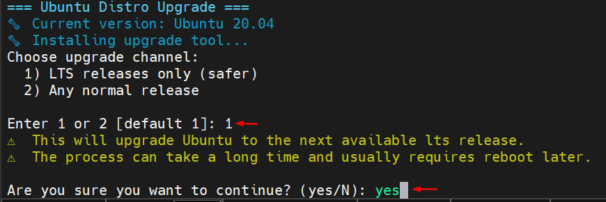

<br/>

---
<br/>

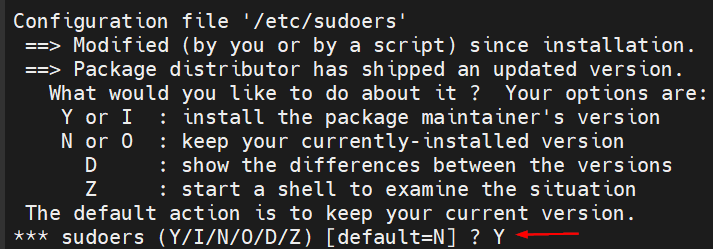

<br/>

---
<br/>

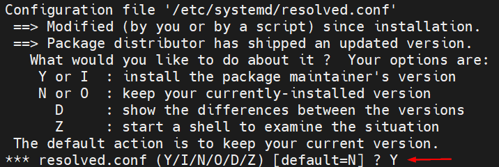

<br/>

---
<br/>

</details>

# After reboot run phase 2:
<br/>

   ```shell
   cd FLSUN_V400_Installing_stock_klipper && sudo chmod -R +x . && sudo ./install_scripts/start_install.sh
   ```
<br/>


- `cd ...` — enter project folder
- `sudo chmod -R +x .` — make scripts executable (safe to repeat)
- `sudo ./install_scripts/start_install.sh` — start menu

<br/>
<br/>

## Phase 2 prompt suggestions

<details>
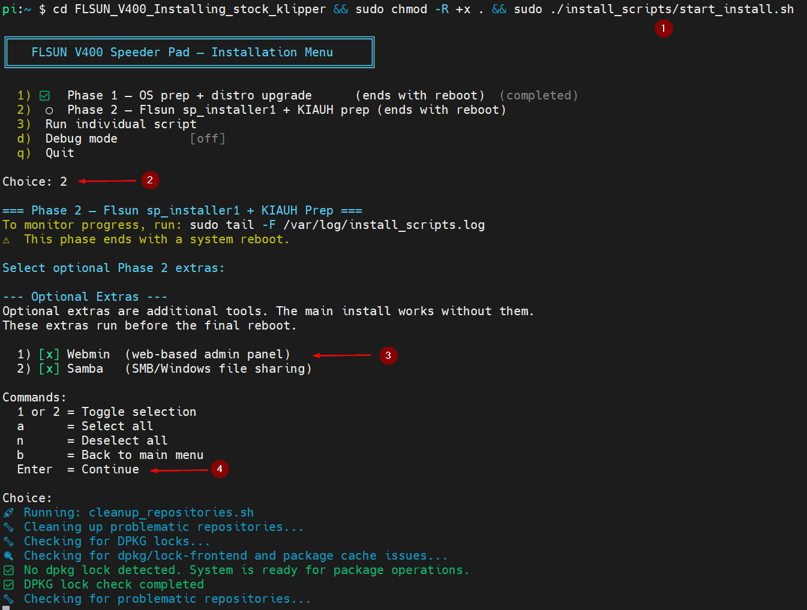

<br/>

---
<br/>


<br/>

---
<br/>


<br/>

---
<br/>


<br/>

---
<br/>

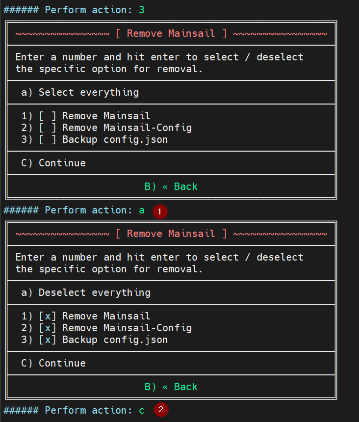

<br/>

---
<br/>

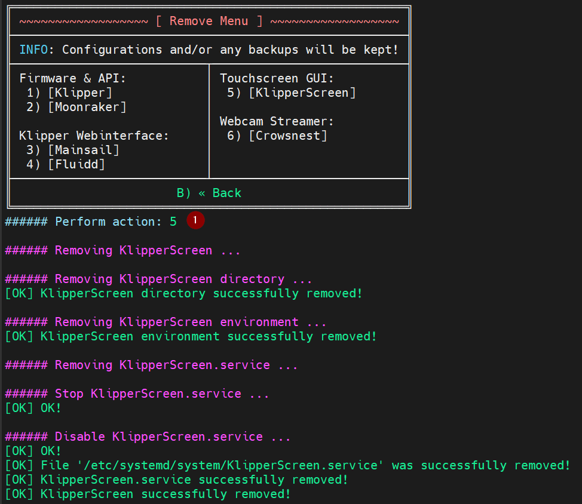

<br/>

---
<br/>


<br/>

---
<br/>


<br/>

---
<br/>


<br/>

---
<br/>

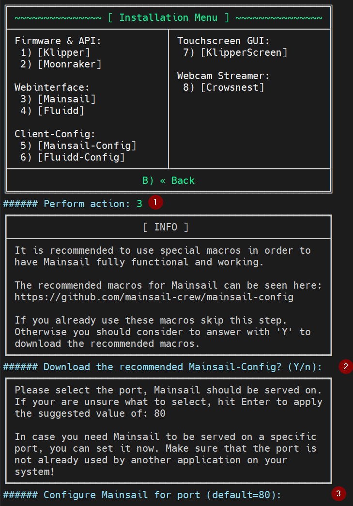

<br/>

---
<br/>

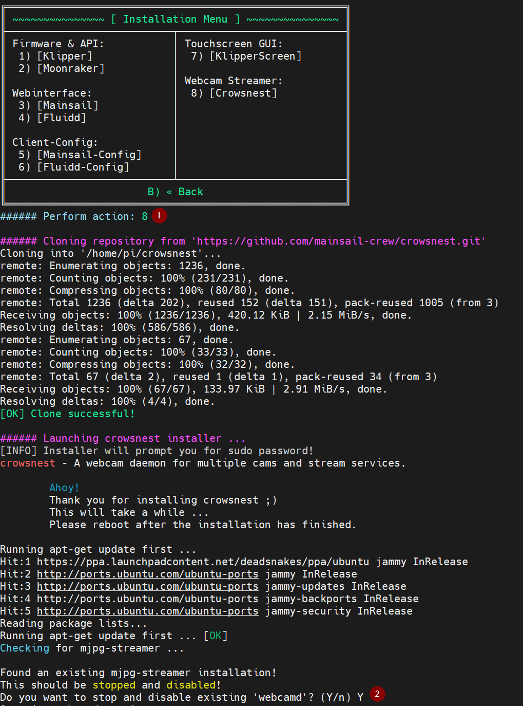

<br/>

---
<br/>

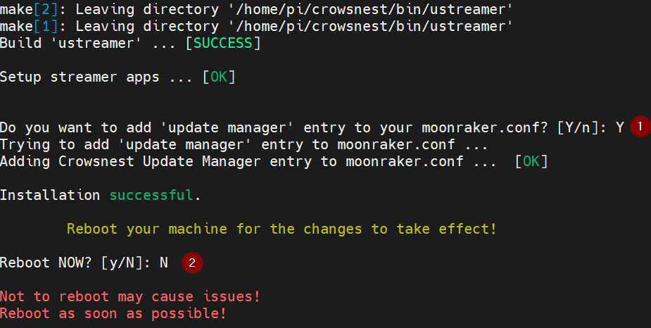

<br/>

---
<br/>

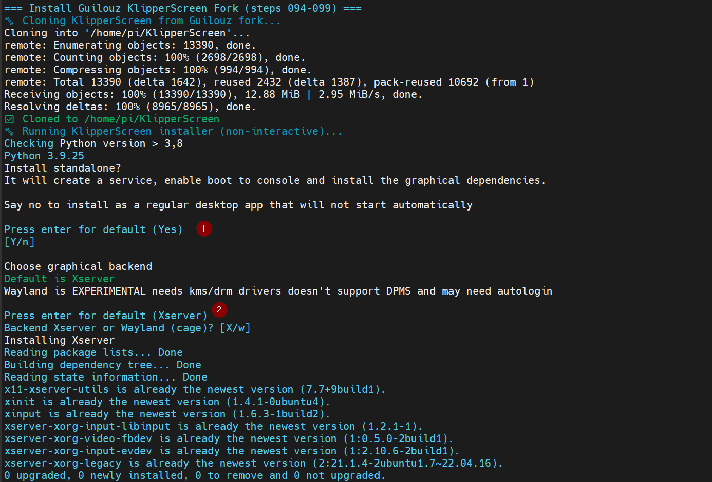

<br/>

---
<br/>
</details>

# Install Git (if needed)
<br/>

```shell
sudo apt update && sudo apt install git && git --version
```

# Success Checklist

## After Phase 1:
- OS upgraded to Ubuntu 22.04
- NetworkManager installed and active
- WiFi connected using your SSID
- DNS resolving correctly
- Systemd-networkd fully disabled

## After Phase 2:
- Klipper running (`systemctl status klipper`)
- Moonraker running (`systemcthttps://github.com/VLoorenDeJong/FLSUN_V400_Installing_stock_klipperl status moonraker`)
- Mainsail accessible in browser
- Printer profile selected
- USB symlink `/dev/printer` exists
- FLSUN theme restored

# Log Locations

- Installer log: `/var/log/installer.log`
- Klipper log: `/tmp/klippy.log`
- Moonraker log: `/var/log/moonraker.log`
- NetworkManager log: `journalctl -u NetworkManager`
- DNS resolver log: `journalctl -u systemd-resolved`


# Disabling scripts
To skip a certain step comment out the script in `install_scripts\start_install.sh` with `#` in front of the line
<details>
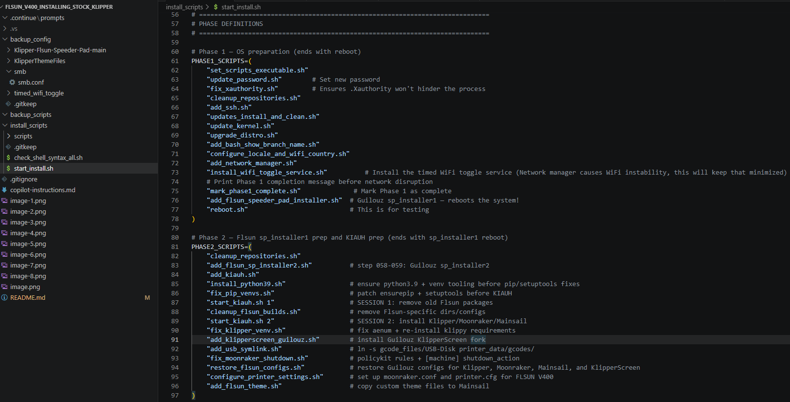
</details>

# Uninstall / Cleanup

## Revert to stock Speeder Pad
1. Reflash the official FLSUN Speeder Pad firmware.


# FAQ

## Does this replace the printer firmware?
No. It replaces the Speeder Pad software environment only.

## Can I still use KIAUH?
Yes. After Phase 2 completes, KIAUH works normally.

## Does this work on the Super Racer?
No. Only the FLSUN V400 Speeder Pad is supported.

## Do I need to run both phases?
Yes. Phase 1 prepares the OS and networking.  
Phase 2 installs Klipper/Moonraker/Mainsail.

## Will this break my printer?
No — the printer firmware is untouched.


# Contributing

Pull requests are welcome!

Guidelines:
- Fork the repo
- Create a feature branch
- Make sure your script is valid `check_shell_syntax_all.sh`
- Submit a PR with a clear description
